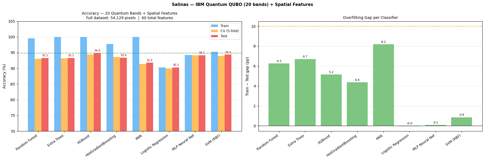
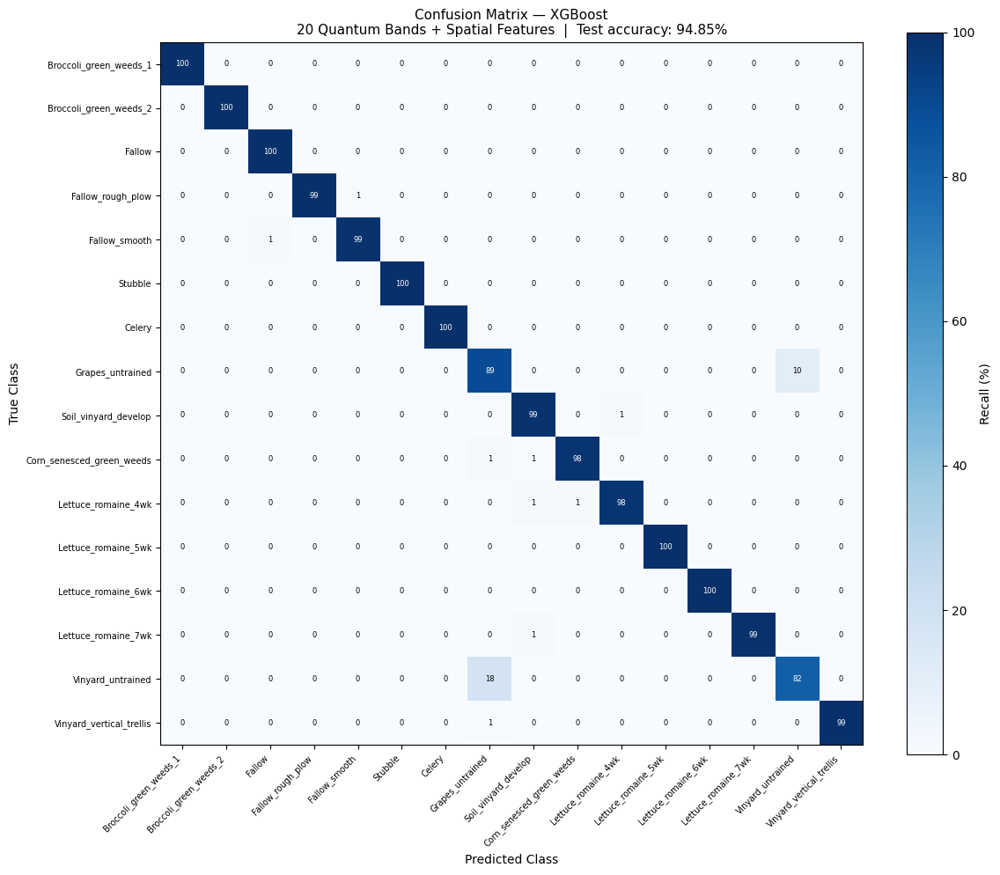
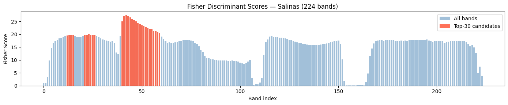
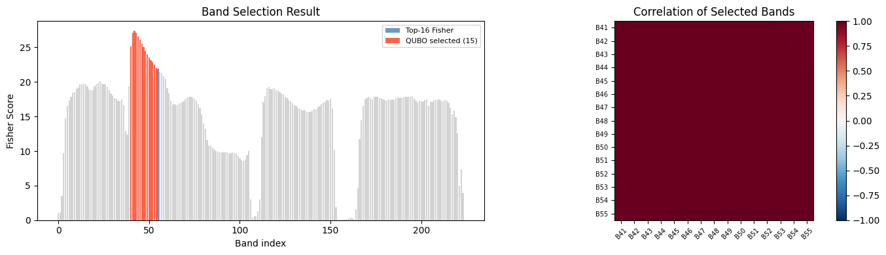
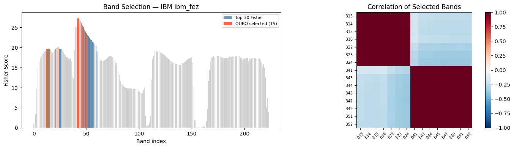
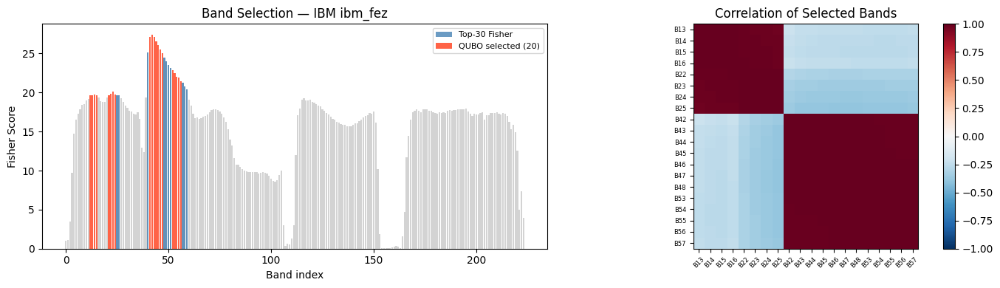

````markdown
# Quantum-Classical Hybrid Band Selection for Hyperspectral Image Classification

**QUBO + QAOA band selection on real IBM Quantum hardware, benchmarked against simulated annealing and statevector simulation, evaluated on the Salinas hyperspectral dataset (224 spectral bands, 54,129 pixels, 16 classes).**

[](https://www.ibm.com/quantum/qiskit)
[-blue)](https://quantum.ibm.com)
[](https://www.python.org)
[](https://scikit-learn.org)

---

## Project Resources

- 📄 [One-page Project Summary](docs/salinas_qubo_onepager.pdf)
- 📘 [Full Research Paper](docs/paper.pdf)
- 📊 [Interactive Dashboard](index.html)

---

## Project Summary

Hyperspectral image classification involves hundreds of spectral bands, many of which contain redundant information. Selecting a compact subset of informative and non-redundant bands can significantly reduce computational complexity while maintaining classification performance.

This project formulates hyperspectral band selection as a **Quadratic Unconstrained Binary Optimization (QUBO)** problem and solves it using both classical and quantum approaches, including **QAOA executed on real IBM Quantum hardware (`ibm_fez`)**.

### Key Results

| Metric | Result |
|----------|----------|
| Best Overall Accuracy (OA) | **94.85%** |
| Best Average Accuracy (AA) | **97.60%** |
| Best Kappa Score | **0.9426** |
| Dimensionality Reduction | **224 → 20 bands (~91% reduction)** |
| Quantum Hardware | IBM Quantum `ibm_fez` (30-qubit QAOA) |
| Best Classifier | XGBoost |

---

## Problem Formulation

Band selection is formulated as a constrained optimization problem:

**Minimize:**

\[
Q(x) = -\sum Fisher(i)x_i + \beta \sum |corr(i,j)|x_ix_j
\]

**Subject to:**

\[
\sum x_i = k
\]

where:

- **Fisher(i)** rewards discriminative spectral bands
- **corr(i,j)** penalizes redundancy between selected bands
- **k** is the desired number of selected bands

This formulation balances informativeness and diversity within the selected subset.

---

## Methodology

```text
224-band Salinas dataset
        │
        ▼
Fisher Discriminant Analysis
        │
        ▼
QUBO Construction
        │
        ▼
Optimization
 ├─ Simulated Annealing
 ├─ QAOA Statevector (16 qubits)
 ├─ QAOA Statevector (20 qubits)
 ├─ QAOA IBM Quantum (30 qubits, 15 bands)
 └─ QAOA IBM Quantum (30 qubits, 20 bands)
        │
        ▼
Feature Extraction
        │
        ▼
8 Machine Learning Classifiers
        │
        ▼
Performance Evaluation
````

The complete mathematical derivation, QUBO formulation, QAOA circuit construction, experimental setup, and analysis are documented in the accompanying research paper.

### Machine Learning Classifiers

The selected band subsets were evaluated using:

* Support Vector Machine (SVM)
* Random Forest (RF)
* Extra Trees (ET)
* Histogram Gradient Boosting (HGB)
* K-Nearest Neighbors (KNN)
* Logistic Regression (LR)
* Multi-Layer Perceptron (MLP)
* XGBoost

---

## Experimental Configurations

| Config | Solver                  | Qubits | Bands | Spatial Features | Split | Best OA    | Best AA    |
| ------ | ----------------------- | ------ | ----- | ---------------- | ----- | ---------- | ---------- |
| 1      | Simulated Annealing     | –      | 15    | No               | 80/20 | 91.06%     | 95.06%     |
| 2      | QAOA Statevector        | 16     | 15    | No               | 80/20 | 89.19%     | 91.68%     |
| 3      | QAOA Statevector        | 20     | 15    | No               | 80/20 | 89.19%     | 91.68%     |
| 4      | IBM Quantum (`ibm_fez`) | 30     | 15    | No               | 80/20 | 91.46%     | 95.37%     |
| 5      | IBM Quantum (`ibm_fez`) | 30     | 20    | Yes              | 90/10 | **94.85%** | **97.60%** |

---

## Results

### Classification Performance

<p align="center">

</p>

### Confusion Matrix (Best Configuration)

<p align="center">

</p>

The best-performing configuration combines:

* IBM Quantum QAOA-selected bands
* 20 spectral bands
* 3×3 spatial-spectral feature extraction
* XGBoost classifier

This configuration achieved the highest overall classification accuracy and class-wise performance.

---

## Band Selection Analysis

### Fisher Score Distribution

<p align="center">

</p>

### Selected Band Sets

#### Statevector QAOA (16 qubits)

<p align="center">

</p>

#### IBM Quantum QAOA (15 bands)

<p align="center">

</p>

#### IBM Quantum QAOA (20 bands)

<p align="center">

</p>

A key observation from the experiments is that increasing the number of available qubits alone does not necessarily improve classification performance. The diversity and quality of candidate spectral bands have a greater impact on downstream accuracy than qubit count itself.

---

## Quantum vs Classical Performance

### IBM Quantum Hardware

* Backend: `ibm_fez`
* Architecture: Heron r2
* QAOA depth: p = 1
* Real hardware execution
* 30 logical qubits

### Observations

* Real quantum hardware achieved a QUBO cost extremely close to the simulated annealing optimum.
* Hardware execution avoided the exponential memory growth associated with statevector simulation.
* Simulated annealing remained a strong classical baseline.
* Results demonstrate the practical feasibility of quantum-assisted optimization for hyperspectral band selection on current NISQ-era hardware.

---

## Dataset

Experiments were performed using the **Salinas hyperspectral scene dataset**.

Dataset source:

[https://zenodo.org/records/15771735](https://zenodo.org/records/15771735)

Required files:

* `Salinas.mat`
* `Salinas_gt.mat`

These files are not included in this repository and must be downloaded separately.

---

## Interactive Dashboard

An interactive project dashboard is included in:

`index.html`

The dashboard provides:

* Experimental overview
* Performance summaries
* Visualizations
* Quantum versus classical comparisons
* Key findings

After enabling GitHub Pages, the dashboard can be accessed directly through a public URL.

---

## Repository Structure

```text
salinas-qubo-classifier/
├── README.md
├── index.html
├── notebooks/
│   ├── Salinas_QUBO_Final_Annealer_15_bands.ipynb
│   ├── Salinas_QUBO_Final_IBM_30qubits_15_bands_80-20.ipynb
│   ├── Salinas_QUBO_Final_stateVector_16_qubits_15_bands.ipynb
│   ├── Salinas_QUBO_Final_statevector_20qubits_15_bands.ipynb
│   ├── Salinas_QUBO_IBM_30qubits_20_bands_part_1_90-10.ipynb
│   └── Salinas_QUBO_IBM_30qubits_20_bands_part_2_90-10.ipynb
├── assets/
│   ├── accuracy_comparison_ibm20b.png
│   ├── band_selection_ibm15b.png
│   ├── band_selection_ibm20b.png
│   ├── band_selection_sv16q.png
│   ├── confusion_matrix_ibm20b.png
│   └── fisher_scores_annealing.png
├── docs/
│   ├── paper.pdf
│   └── salinas_qubo_onepager.pdf
├── requirements.txt
└── .gitignore
```

---

## Reproducing the Experiments

1. Download the Salinas dataset.
2. Open the desired notebook in Google Colab or Jupyter Notebook.
3. Upload:

   * `Salinas.mat`
   * `Salinas_gt.mat`
4. Install dependencies:

```bash
pip install -r requirements.txt
```

For IBM Quantum hardware notebooks, configure your credentials before execution:

```python
import os

os.environ["IBM_QUANTUM_TOKEN"] = "your-token"
os.environ["IBM_QUANTUM_INSTANCE"] = "your-instance"
```

A free IBM Quantum account can be created at:

[https://quantum.ibm.com](https://quantum.ibm.com)

---

## Requirements

```text
numpy
scipy
scikit-learn
matplotlib
xgboost
qiskit>=2.0.0
qiskit-ibm-runtime>=0.30.0
```

---

## Citation

If you use this work for academic or research purposes, please cite:

Tayade, J.K. & More, C.

*Quantum-Classical Hybrid Pipeline for Hyperspectral Band Selection and Classification: A Comparative Study Using QUBO Optimization on IBM Quantum Hardware.*

2026.

```

One note: **don't test image links, PDF links, or notebook links until after `assets/`, `docs/`, and `notebooks/` are actually pushed to GitHub via Git.** Right now, locally the README is correct; those links will only work once the folders exist in the repository.
```
